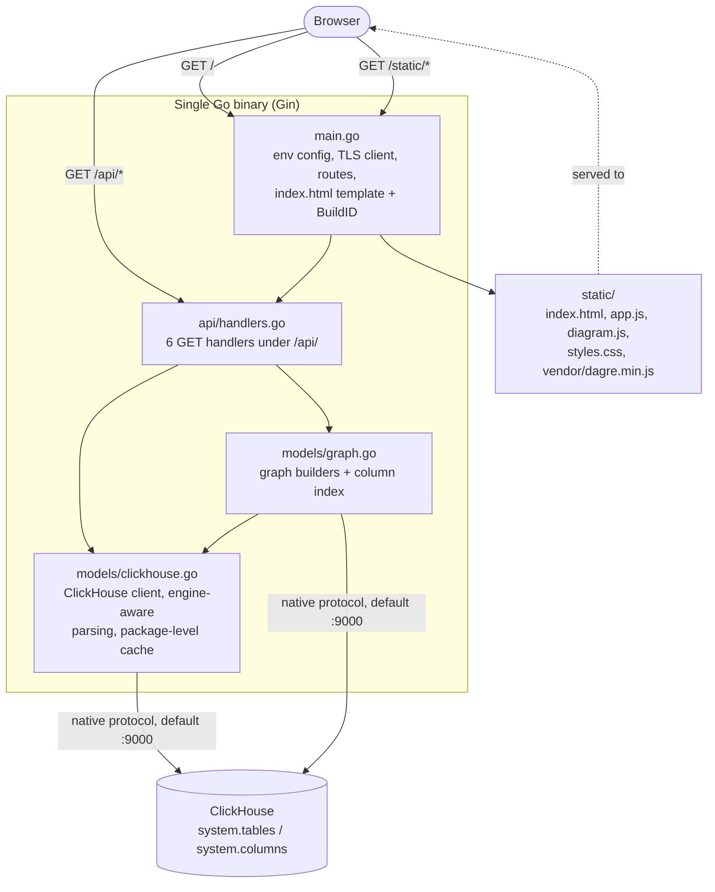

# ARCHITECTURE.md — ClickHouse Schema Flow Visualizer

How the system is built and why. Keep this in sync with the code: when a component,
data flow, integration, or dependency changes, update the matching section here and
the relevant diagram in [docs/diagrams/](docs/diagrams/).

> Audience: engineers and reviewers.
> Rule: diagrams and prose must match the code. Mark unverified parts `TODO:`.

---

## 1. System overview

A single Go binary (`main.go`, module `github.com/fulgerX2007/clickhouse-schemaflow-visualizer`, go.mod:1) runs one Gin server that serves both a JSON API under `/api/` and the vanilla-JS frontend in `static/` (main.go:52-80). It opens one pooled ClickHouse client over the native protocol (`clickhouse.Open` in models/clickhouse.go `NewClickHouseClient`, which returns a pooled `driver.Conn`) and reads **only** `system.tables` and `system.columns` — the application owns no schema, no migrations, and has no write path (models/clickhouse.go, models/graph.go).

In scope: discovering table relationships by parsing `create_table_query`, `engine_full`, and the `loading_dependencies_*` columns per engine family (models/clickhouse.go `getTablesRelations`); returning a table-level DAG and a column-level graph with transformation expressions (models/graph.go); and rendering both in the browser with the bundled Dagre layout engine and hand-written inline SVG (static/js/diagram.js).

Out of scope, verified absent from the codebase: authentication, authorization, CORS, rate limiting, pagination, and any statement that mutates ClickHouse (grep over main.go, api/handlers.go; every query in models/ is a `SELECT` against a system table).

## 2. Component diagram



| Component | Responsibility | Source location |
|-----------|----------------|-----------------|
| Bootstrap / HTTP server | Loads `.env` via godotenv, builds `models.Config` from `os.Getenv`, creates the ClickHouse client (fatal on failure), registers routes, serves `/static` with `Cache-Control: no-cache`, renders `/` through `html/template` with a per-process `{{.BuildID}}` cache-buster | `main.go` (config main.go:29-42, static main.go:62-66, index main.go:72-80) |
| API handler layer | Six thin `GET` handlers under `/api/`; validates that `:database`/`:table` are non-empty (400) and maps any client error to 500 `{"error": msg}`; `/api/connection` deliberately omits the password | `api/handlers.go` (routes :26-34, connection :41-47) |
| ClickHouse client + relation discovery | Connection and TLS setup, the single `system.tables` scan, engine-aware relation extraction, the in-memory cache, `GetTableColumns`, MV `SELECT` parsing (`parseViewQuery`, `extractColumnMappings`), `isDistributedTable`, and the column-relatedness heuristics | `models/clickhouse.go` |
| Graph builders | `BuildDataFlowGraph` (forward/backward walk), `BuildRelationshipsGraph` (MV and regular paths), `BuildColumnIndex`, and `ClassifyEngine` — the five `EngineType` strings that are the styling contract with the frontend | `models/graph.go` |
| Frontend shell | Go template; every CSS/JS tag carries `?v={{.BuildID}}`; loads Font Awesome from cdnjs and Inter/JetBrains Mono from Google Fonts | `static/html/index.html` (fonts :7-9, dagre :31, font-awesome :31, app scripts :171-172) |
| App controller | Sidebar tree, filter, `Ctrl+K`/`⌘K` command palette backed by `/api/columns`, table inspector, metadata toggles persisted in `localStorage`, Export HTML (which inlines `commonDiagramCss()`, duplicating diagram styling that also lives in `static/css/styles.css`) | `static/js/app.js` (graph fetch :333-334, details :388, column index :746, `commonDiagramCss` :540) |
| Diagram renderer | `window.SchemaDiagram.renderDataFlow(container, graph, {onNodeClick})` and `.renderRelationships(container, graph, {onTableClick})`; lays out with Dagre and builds SVG with `createElementNS` (`innerHTML` is used only to clear the container, diagram.js:243, :415) | `static/js/diagram.js` |
| Layout engine (vendored) | Dagre, bundled in-repo; no build step and no package manifest the app uses | `static/js/vendor/dagre.min.js` |
| Styles | Diagram and shell CSS, including the per-`EngineType` classes | `static/css/styles.css` |
| Dead code | `config.LoadConfig()` exists but no Go file imports package `config` (verified by grep over `main.go api models config`); `main.go` builds `models.Config` inline instead. Do not treat it as the active loader. | `config/config.go` |
| Unreferenced asset | `static/js/all.min.js` is present in the tree but is not referenced by `static/html/index.html` (verified by grep) | `static/js/all.min.js` |

`github.com/go-faster/city` is declared in the go.mod require block but is not referenced by any Go file (verified by grep over `main.go api models config`); graph node IDs are plain `database.table` strings, not hashes (models/graph.go `addNode`).

## 3. Data flow

```mermaid
flowchart LR
    pick(["User picks a table in the sidebar"]) --> app["static/js/app.js<br/>loadTableGraphs()"]
    app -->|"GET /api/dataflow/db/table"| h["api/handlers.go<br/>GetDataFlowGraph"]
    h --> b["models/graph.go<br/>BuildDataFlowGraph"]
    b --> cache{"DatabasesData +<br/>TableRelations +<br/>TableMetadata filled?"}
    cache -->|"yes"| walk["walkForward + walkBackward<br/>depth &lt; maxRelationDepth (50)"]
    cache -->|"no"| scan["getTablesRelations()<br/>one SELECT ... FROM system.tables"]
    scan --> ch[("ClickHouse<br/>system.tables")]
    ch --> parse["Engine-aware string parsing;<br/>allowedDatabase() filter;<br/>fills the package-level cache"]
    parse --> walk
    walk --> json["JSON payload: nodes + edges"]
    json --> dagre["static/js/diagram.js<br/>dagre.layout()"]
    dagre --> svg(["Inline SVG built with createElementNS"])
```



**Representative request, end to end.** The user clicks a table; `loadTableGraphs()` fires `/api/dataflow/:database/:table` and `/api/relationships/:database/:table` in parallel (static/js/app.js:333-334). `GetDataFlowGraph` rejects empty params with 400 and otherwise calls `BuildDataFlowGraph` (api/handlers.go). That builder calls `getTablesRelations()`, which returns the cached slice if `TableRelations`, `DatabasesData`, and `TableMetadata` are all non-nil, and otherwise issues the one full scan: `SELECT create_table_query, engine_full, engine, database, name, loading_dependencies_database, loading_dependencies_table, total_rows, total_bytes FROM system.tables ORDER BY name` (models/clickhouse.go). Each row is filtered through `allowedDatabase()` and parsed by engine family — MergeTree and `Replicated*` take `split(" ")[2]` of the CREATE query; `Dictionary*` uses the `loading_dependencies_*` columns; `Distributed` splits `engine_full` on `'` and needs at least 6 parts; `MaterializedView` emits two relations, source→MV (from `"FROM "`) and MV→destination (`split(" ")[5]`). There is no SQL parser anywhere in the repo; this is positional string splitting. The same pass fills the sidebar label map, where the table name is `html.EscapeString`'d (`generateTableListContent`). `BuildDataFlowGraph` then runs `walkForward` and `walkBackward` from `database.table`, de-duplicating edges through a `seen` set (models/graph.go). The `{nodes, edges}` JSON goes back to the browser, where `diagram.js` runs `dagre.layout()` and draws the result as inline SVG.

**Cache lifecycle.** `DatabasesData`, `TableRelations`, and `TableMetadata` are package-level vars (models/clickhouse.go:34-36) filled on first use and **never invalidated** — no TTL, no invalidation endpoint, no refresh path exists in the code. A process restart is the only way to pick up schema changes. `GetTableColumns`, `BuildColumnIndex`, and `isDistributedTable` are uncached and hit ClickHouse on every call.

**Depth bound.** `walkForward` and `walkBackward` are mutually independent recursive walks, each returning as soon as `depth >= maxRelationDepth`, which is `50` (models/clickhouse.go:16). Combined with the `seen` edge set, that bounds traversal on cyclic or pathological relation graphs.

**Distributed exclusion.** The column-level builders skip `Distributed` tables: `buildMVRelationshipsGraph` returns an error when the MV's source resolves to a Distributed table, skips a Distributed destination, and ignores Distributed candidates while inferring a destination; `buildRegularRelationshipsGraph` filters both `sourceIDs` and `destIDs` through `isDistributedTable` (models/graph.go). Each check is its own `SELECT engine FROM system.tables WHERE database = ? AND name = ?` round trip. Distributed tables still appear in the table-level data-flow graph.

**Duplicated database filter.** The exclusion list exists twice and must be changed in both places: `allowedDatabase()` rejects `system`, `information_schema` (case-insensitively), `performance_schema`, and `mysql` (models/clickhouse.go); `BuildColumnIndex` repeats the same list as a hardcoded SQL `NOT IN ('system', 'information_schema', 'INFORMATION_SCHEMA', 'performance_schema', 'mysql')` (models/graph.go). Divergence would let the command palette index columns from a database the sidebar hides.

## 4. External integrations

| Integration | Direction | Protocol | Notes |
|-------------|-----------|----------|-------|
| ClickHouse server | out | ClickHouse native protocol, default port 9000, optional TLS | The only backend dependency. Read-only: `system.tables` and `system.columns` exclusively. Client and TLS setup in `models/clickhouse.go` `NewClickHouseClient`; a failed `Ping` at startup is fatal (main.go:45-48) |
| Google Fonts | out, from the viewer's browser | HTTPS | `preconnect` + stylesheet for Inter and JetBrains Mono (static/html/index.html:7-9) |
| cdnjs (Font Awesome 6.4.0) | out, from the viewer's browser | HTTPS, with SRI `integrity` and `crossorigin` | Icon CSS (static/html/index.html:32). Icon markup is also produced server-side in `generateTableListContent` (models/clickhouse.go) |
| GitHub Container Registry (`ghcr.io`) | out, from CI only | HTTPS | Image `ghcr.io/fulgerx2007/clickhouse-schemaflow-visualizer`, pushed by `.github/workflows/docker-publish.yml` on `v*` tags only |
| ZooKeeper | none at runtime | — | The image `zookeeper:3.7` appears only in `docker-compose.clickhouse-test.yml`, and the ZooKeeper wiring it depends on is in `config/clickhouse-config.xml:3-8`, mounted into the test ClickHouse as `/etc/clickhouse-server/config.d/zookeeper.xml` (docker-compose.clickhouse-test.yml:23), for that server's `Replicated*` engines. The application never talks to it |

## 5. Service dependencies

- **Internal services this depends on:** none. The binary depends on exactly one external system, the ClickHouse instance named by `CLICKHOUSE_HOST`/`CLICKHOUSE_PORT` (main.go:30-31).
- **Third-party / infra dependencies:** Go direct modules `github.com/ClickHouse/clickhouse-go/v2 v2.34.0`, `github.com/gin-gonic/gin v1.10.0`, `github.com/joho/godotenv v1.5.1`, plus the declared-but-unreferenced `github.com/go-faster/city v1.0.1` (go.mod). Frontend: the vendored `static/js/vendor/dagre.min.js`, and the two CDNs in section 4. Runtime images: `golang:1.27-alpine` builder and `alpine:3.18` with `ca-certificates` (Dockerfile).
- **Failure modes & fallbacks:**
  - Startup, ClickHouse unreachable or `Ping` fails: `log.Fatalf` — the process exits rather than starting degraded (main.go:45-48).
  - Startup, `./static/html/index.html` missing: `template.Must` panics (main.go:72). Both this path and `router.Static("/static", "./static")` (main.go:66) resolve relative to the working directory.
  - Startup, no `.env`: warning only; the process continues on ambient environment variables (main.go:19-21).
  - Request time, any ClickHouse error: 500 with `{"error": msg}` (api/handlers.go). There is no retry, backoff, timeout override, or circuit breaker anywhere in the codebase — every query uses `context.Background()` (models/clickhouse.go, models/graph.go).
  - Frontend: a failed `/api/dataflow` throws and shows an error banner; a failed `/api/relationships` degrades silently to `{tables: [], edges: []}` (static/js/app.js:336-341).
  - Stale data: because the cache is never invalidated, a schema change in ClickHouse is invisible until the process restarts (models/clickhouse.go:34-36).
  - `BuildRelationshipsGraph` deliberately errors out for a materialized view whose source is `Distributed`, which surfaces as a 500 for that one table (models/graph.go).

## 6. Scalability considerations

- **Expected load / scaling dimension:** TODO: no load figures, benchmarks, capacity targets, or SLOs exist anywhere in the repository.
- **Bottlenecks & how they're addressed:**
  - Cold start cost is one full `system.tables` scan plus per-row string parsing, paid by the first request that needs relations; every later table-level graph is served from memory (models/clickhouse.go `getTablesRelations`).
  - `/api/columns` runs an unfiltered `system.columns` scan across all allowed databases on **every** call and returns the whole index in one unpaginated response (models/graph.go `BuildColumnIndex`). The frontend fetches it once and caches it in a promise (static/js/app.js:746).
  - `/api/relationships` is the expensive endpoint: `GetTableColumns` costs two queries per table, and `isDistributedTable` is one query per candidate relation, called inside the source/destination loops (models/graph.go). Cost grows with the neighbour count of the selected table.
  - Traversal is bounded by `maxRelationDepth = 50` and the `seen` edge set (models/clickhouse.go:16, models/graph.go).
  - No pagination exists on any endpoint (api/handlers.go).
- **Statefulness / partitioning / batching:** the process is stateful only in those three package-level cache vars, which are per-process and never shared. Two replicas therefore hold two independent snapshots captured at different times and can serve divergent schemas; there is no shared cache, no cache-warming hook, and no invalidation API. The frontend keeps only UI preferences (`activeSection`, `metadataVisible`, `tableDetailsVisible`, collapse states) in `localStorage` (static/js/app.js). `docker-compose.yml` runs exactly one container with `network_mode: "host"`.

## 7. Security architecture

- **Trust boundaries:** two. (1) Browser → Gin server: unauthenticated; anyone who can reach `SERVER_ADDR` can call every endpoint. (2) Server → ClickHouse: one credential set from the environment, shared by every request from every viewer — so reaching the web UI grants the full read access of the configured ClickHouse user over `system.tables`/`system.columns`. TODO: the intended deployment posture (whether the listener is expected to sit behind an authenticating proxy or on a trusted network) is not stated anywhere in the repository.
- **AuthN / AuthZ flow:** none exists. There is no auth, token, session, or CORS middleware in `main.go` or `api/handlers.go` (verified by grep); all six routes are anonymous `GET` (api/handlers.go:26-34). The only access control in the code is the database exclusion list (`allowedDatabase()` in models/clickhouse.go, duplicated in `BuildColumnIndex` in models/graph.go).
- **Secrets & key management:** `CLICKHOUSE_PASSWORD` and the TLS paths come from environment variables, optionally seeded from a `.env` file in the working directory by godotenv (main.go:19, main.go:33-41; `.env.example`). The password is never returned by `/api/connection`, which exposes only host, port, user, database, and the secure flag (api/handlers.go:41-47). TLS wiring loads the client cert+key pair together, appends the CA to a fresh `x509` pool, sets `ServerName` for SNI, and honours `InsecureSkipVerify` (models/clickhouse.go `NewClickHouseClient`) — note that the shipped `.env.example` sets both `CLICKHOUSE_SECURE=true` and `CLICKHOUSE_SKIP_VERIFY=true`. Packaging defect: `scripts/postinstall.sh` writes `/etc/clickhouse-schemaflow-visualizer/config.env` mode 0640 root:service-group, but the systemd unit it installs declares no `EnvironmentFile`, so that file is never loaded; the same unit sets `WorkingDirectory=/var/lib/clickhouse-schemaflow-visualizer` while `.goreleaser.yaml` installs assets to `/usr/share/clickhouse-schemaflow-visualizer/static`, so the packaged service also cannot find `./static`. No secret-manager integration exists in the repo. TODO: the approved production mechanism for supplying the ClickHouse password.
- **Network exposure / surface:** one listener, `SERVER_ADDR`, default `:8080` (main.go:83); `Dockerfile` `EXPOSE 8080`; `docker-compose.yml` uses `network_mode: "host"`, which binds the host network directly. Surface is the six `/api/` GETs plus `GET /` and `/static/*`. The installed systemd unit runs as a dedicated system user with `NoNewPrivileges=true`, `PrivateTmp`, `ProtectSystem=strict`, `ProtectHome`, `ReadWritePaths` limited to `/var/lib` and `/var/log`, and `CAP_NET_BIND_SERVICE` only (scripts/postinstall.sh). Injection surface: the user-controlled `:database`/`:table` path params are always passed as bound `?` parameters, never concatenated into SQL (models/clickhouse.go `GetTableColumns`, `isDistributedTable`; models/graph.go `BuildRelationshipsGraph`). On the render path, `diagram.js` builds SVG with `createElementNS` and uses `innerHTML` only to clear the container (static/js/diagram.js:243, :415); `app.js addTableToList` does assign `innerHTML` from the server-rendered sidebar fragment, whose table name is escaped server-side with `html.EscapeString` (models/clickhouse.go `generateTableListContent`, static/js/app.js:233-243).
- **Audit / logging of sensitive actions:** the app performs no mutations against ClickHouse, so there are no sensitive actions to audit. `gin.Default()` installs the request logger, so every request line goes to stdout (main.go:52); `extractColumnMappings` logs every parsed column mapping and `getTablesRelations` logs cache hits/misses via `log.Printf`/`log.Println` (models/clickhouse.go). Under the packaged systemd unit these land in the journal (`journalctl -u clickhouse-schemaflow-visualizer -f`, scripts/postinstall.sh). TODO: log retention, shipping, and any redaction policy.

## 8. Key decisions

Significant, hard-to-reverse choices are recorded as ADRs in
[docs/decisions/](docs/decisions/). Link the relevant ones here as they accrue.

`docs/decisions/` is currently empty — no ADRs have been written yet. The following choices are visible in the code and are the obvious first candidates to record:

- Cache the `system.tables` scan in package-level vars for the process lifetime, with no invalidation path (models/clickhouse.go:34-36).
- Extract relations by positional string splitting on `create_table_query`/`engine_full` rather than parsing SQL (models/clickhouse.go `getTablesRelations`).
- Use plain `database.table` strings as graph node IDs (models/graph.go `addNode`).
- Freeze five `EngineType` values as the styling contract shared by `ClassifyEngine` (models/graph.go), `classifyEngine()`/`glyphFor()` (static/js/app.js:16, :887), the legend (static/html/index.html), and the CSS classes (static/css/styles.css).
- Render with a hand-written Dagre + inline-SVG renderer (static/js/diagram.js). Note the stale metadata: `.goreleaser.yaml`'s nfpm `description` and `rpm.summary` still describe "Mermaid.js diagrams", which the code no longer uses.
- Bound relation traversal at `maxRelationDepth = 50` (models/clickhouse.go:16) and exclude `Distributed` tables from column-level graphs (models/graph.go).
- Gate CI entirely on `v*` tags: neither `.github/workflows/release.yml` nor `.github/workflows/docker-publish.yml` runs on push to `master` or on pull requests, so nothing is checked automatically before a tag exists. The `go test ./...` step in the release workflow does now assert something — `api` and `models` carry tests — but it still runs only on a tag, so nothing checks a pull request.


## Grafana column usage

An optional second lineage source, added on top of the ClickHouse-only picture above. It
answers "which columns does nobody read?" by mapping Grafana dashboards to the columns
their SQL touches, then propagating that usage along ClickHouse's own lineage.

```
  source                extract              resolve                    index
  ──────────────        ─────────────        ───────────────────        ──────────────────
  Grafana API      →    panels           →   expand ${vars}         →   references per
   or JSON dir          + row.panels         AST parse ────┐             (db, table, column)
  (grafana.go)          + templating                       ↓           + lineage propagation
                        (grafana.go)         heuristic fallback        + four-state verdicts
                                             (grafana_sql.go)          (usage.go)
```

`models/grafana_index.go` orchestrates: an asynchronous first scan, a TTL, an explicit
refresh, and a state machine (`disabled` / `scanning` / `error` / `ok`) that every
endpoint and every verdict is gated on.

**Components**

| File | Responsibility |
|---|---|
| `models/grafana.go` | Config, `DashboardSource` (API + directory + fallback pair), panel and variable extraction |
| `models/grafana_sql.go` | Variable expansion, AST resolution via `clickhouse-sql-parser`, heuristic fallback |
| `models/usage.go` | `SchemaSnapshot` (2 queries), usage index, lineage propagation, verdicts, report |
| `models/grafana_index.go` | Scan orchestration, caching, state, statistics |
| `api/handlers.go` | Four routes, all gated on the state envelope |
| `static/js/app.js`, `static/css/styles.css` | Usage column in the inspector, unused-columns report section |

**Dependency added:** `github.com/AfterShip/clickhouse-sql-parser` v0.5.6 — the first new
direct dependency since the original four. Rationale and measurements in
`docs/decisions/0001-sql-parser-dependency.md`.

**Data-flow note.** This is the only part of the application that reaches outside
ClickHouse. It is still read-only on both sides: `SELECT` against `system.columns` and
`system.tables`, and `GET` against the Grafana API. `POST /api/grafana/refresh` rebuilds
an in-process cache and nothing else.
