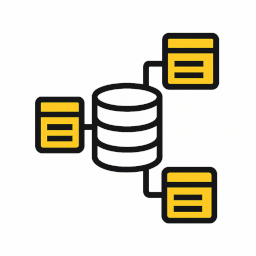
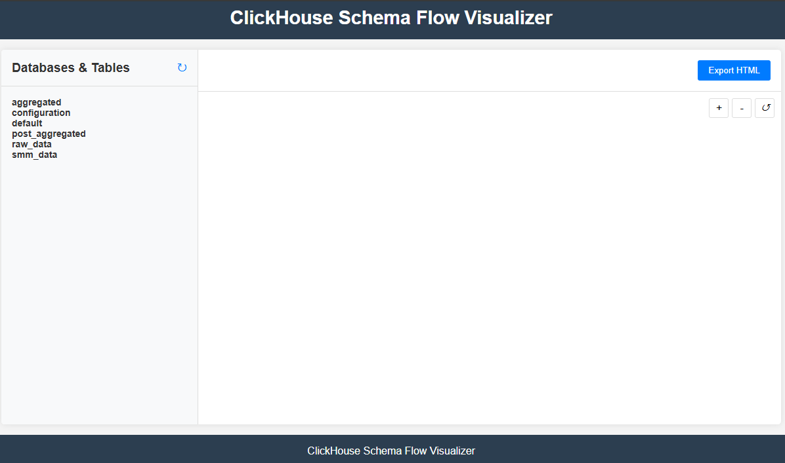
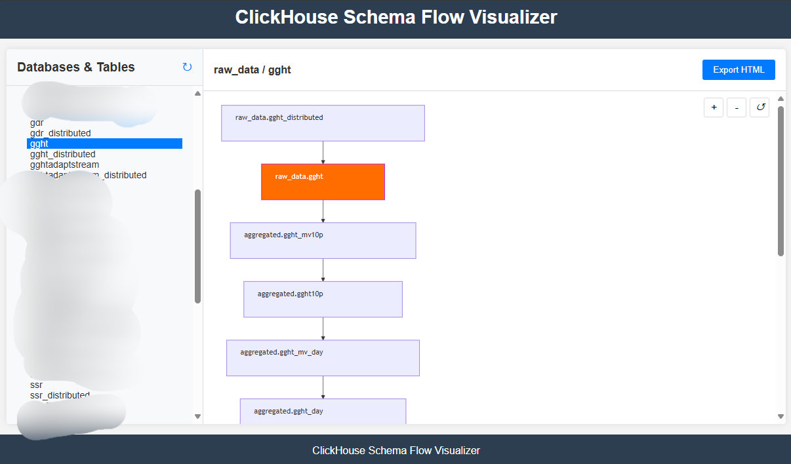
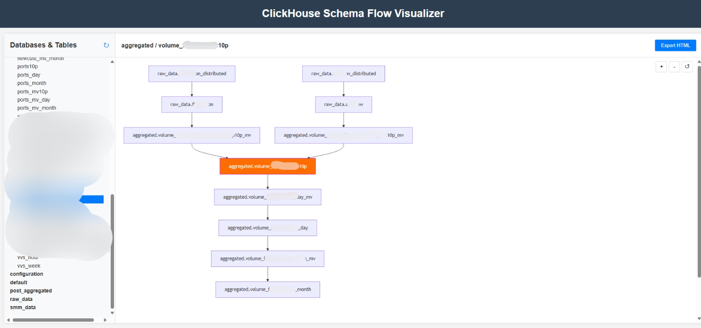

<div align="center">

# ClickHouse Schema Flow Visualizer



A powerful open-source web application for visualizing ClickHouse table relationships using Mermaid.js diagrams. Browse databases and tables with an intuitive interface, explore table metadata with optional row counts and size information, and export interactive schema diagrams.

[](https://github.com/FulgerX2007/clickhouse-schemaflow-visualizer/actions)
[](https://opensource.org/licenses/MIT)
[](https://github.com/FulgerX2007/clickhouse-schemaflow-visualizer/releases)
[](https://goreportcard.com/report/github.com/fulgerX2007/clickhouse-schemaflow-visualizer)

</div>

## 📸 Screenshots

<div align="center">







</div>

## ✨ Features

- 🔍 Browse ClickHouse databases and tables with an intuitive interface
- 📊 Visualize table relationships with Mermaid.js diagrams
- 🎨 Color-coded icons matching table types for better visualization
- ↔️ View direction of data flow between tables
- 📂 Collapsible table types legend for a cleaner interface
- 📈 Toggle metadata visibility (table rows and size information)
- 💾 Export diagrams as standalone HTML files
- 🔒 Secure connection to ClickHouse with TLS support
- 📱 Responsive web interface for all devices

## 🏗️ Architecture

- **Backend**: Golang with Gin framework
- **Frontend**: HTML, CSS, and JavaScript with Mermaid.js
- **Database**: ClickHouse

## 📋 Prerequisites

- Docker and Docker Compose
- ClickHouse server

## 🚀 Installation and Setup

### Using GitHub Container Registry

1. Pull the container from GitHub Container Registry:
   ```bash
   docker pull ghcr.io/fulgerx2007/clickhouse-schemaflow-visualizer:latest
   ```

2. Create a `.env` file with your ClickHouse connection details (see configuration example below)

3. Run the container:
   ```bash
   docker run -p 8080:8080 --env-file .env ghcr.io/fulgerx2007/clickhouse-schemaflow-visualizer:latest
   ```

4. Access the web interface at http://localhost:8080

### Using Docker Compose (Recommended)

1. Clone the repository:
   ```bash
   git clone https://github.com/fulgerX2007/clickhouse-schemaflow-visualizer.git
   cd clickhouse-schemaflow-visualizer
   ```

2. Copy the example environment file and configure it:
   ```bash
   cp .env.example .env
   # Edit .env with your ClickHouse connection details
   ```

3. Start the application:
   ```bash
   docker-compose up -d
   ```

4. Access the web interface at http://localhost:8080

### Using Portainer Stack

If you're using Portainer for container management, you can deploy this application as a stack:

1. **Create a new Stack in Portainer**:
   - Go to Stacks → Add stack
   - Name: `clickhouse-schemaflow-visualizer`

2. **Use the following Docker Compose content**:
   ```yaml
   version: '3.8'
   
   services:
     # ClickHouse Schema Flow Visualizer
     ch-schemaflow-visualizer:
       image: ghcr.io/fulgerx2007/clickhouse-schemaflow-visualizer:latest
       ports:
         - "8080:8080"
       environment:
         # ClickHouse Connection Settings
         - CLICKHOUSE_HOST=your-clickhouse-host
         - CLICKHOUSE_PORT=9000
         - CLICKHOUSE_USER=default
         - CLICKHOUSE_PASSWORD=your-password
         - CLICKHOUSE_DATABASE=default
         
         # ClickHouse TLS Settings (optional)
         - CLICKHOUSE_SECURE=false
         - CLICKHOUSE_SKIP_VERIFY=false
         
         # Web Interface Settings
         - SERVER_ADDR=:8080
         - GIN_MODE=release
   ```

3. **Configure Environment Variables**:
   - Update the environment variables with your actual ClickHouse connection details
   - For security, consider using Portainer's environment variable management or secrets

4. **Deploy the Stack**:
   - Click "Deploy the stack"
   - Wait for the deployment to complete

5. **Access the Application**:
   - Navigate to `http://your-server-ip:8080`
   - Or use your domain if you have a reverse proxy configured

#### Advanced Portainer Configuration

For production deployments, consider this enhanced stack configuration:

```yaml
version: '3.8'

services:
  clickhouse-schemaflow-visualizer:
    image: ghcr.io/fulgerx2007/clickhouse-schemaflow-visualizer:latest
    ports:
      - "8080:8080"
    environment:
      # ClickHouse Connection Settings
      - CLICKHOUSE_HOST=${CLICKHOUSE_HOST:-localhost}
      - CLICKHOUSE_PORT=${CLICKHOUSE_PORT:-9000}
      - CLICKHOUSE_USER=${CLICKHOUSE_USER:-default}
      - CLICKHOUSE_PASSWORD=${CLICKHOUSE_PASSWORD}
      - CLICKHOUSE_DATABASE=${CLICKHOUSE_DATABASE:-default}
      
      # ClickHouse TLS Settings
      - CLICKHOUSE_SECURE=${CLICKHOUSE_SECURE:-false}
      - CLICKHOUSE_SKIP_VERIFY=${CLICKHOUSE_SKIP_VERIFY:-false}
      
      # Web Interface Settings
      - SERVER_ADDR=:8080
      - GIN_MODE=release
    deploy:
      restart_policy:
        condition: unless-stopped
      replicas: 1
      labels:
        # Traefik labels (if using Traefik as reverse proxy)
        - "traefik.enable=true"
        - "traefik.http.routers.clickhouse-viz.rule=Host(`clickhouse-viz.yourdomain.com`)"
        - "traefik.http.routers.clickhouse-viz.tls=true"
        - "traefik.http.routers.clickhouse-viz.tls.certresolver=letsencrypt"
    healthcheck:
      test: ["CMD", "wget", "--quiet", "--tries=1", "--spider", "http://localhost:8080/"]
      interval: 30s
      timeout: 10s
      retries: 3
      start_period: 40s
```

#### Environment Variables for Portainer

When deploying through Portainer, you can set these environment variables in the stack's environment section:

- `CLICKHOUSE_HOST`: Your ClickHouse server hostname or IP
- `CLICKHOUSE_PORT`: ClickHouse port (default: 9000)
- `CLICKHOUSE_USER`: Database username (default: default)
- `CLICKHOUSE_PASSWORD`: Database password
- `CLICKHOUSE_DATABASE`: Default database to connect to
- `CLICKHOUSE_SECURE`: Enable TLS connection (true/false)
- `CLICKHOUSE_SKIP_VERIFY`: Skip TLS certificate verification (true/false)

### Manual Setup

1. Clone the repository:
   ```bash
   git clone https://github.com/fulgerX2007/clickhouse-schemaflow-visualizer.git
   cd clickhouse-schemaflow-visualizer
   ```

2. Configure the `.env` file with your ClickHouse connection details:
   ```
   # ClickHouse Connection Settings
   CLICKHOUSE_HOST=localhost
   CLICKHOUSE_PORT=9000
   CLICKHOUSE_USER=default
   CLICKHOUSE_PASSWORD=
   CLICKHOUSE_DATABASE=default

   # ClickHouse TLS Settings
   CLICKHOUSE_SECURE=false
   CLICKHOUSE_SKIP_VERIFY=false
   # CLICKHOUSE_CERT_PATH=/path/to/cert.pem
   # CLICKHOUSE_KEY_PATH=/path/to/key.pem
   # CLICKHOUSE_CA_PATH=/path/to/ca.pem
   # CLICKHOUSE_SERVER_NAME=clickhouse.example.com

   # Web Interface Settings
   SERVER_ADDR=:8080
   GIN_MODE=debug
   ```

3. Install Go dependencies:
   ```bash
   cd backend
   go mod download
   ```

4. Run the application:
   ```bash
   go run main.go
   ```

5. Access the web interface at http://localhost:8080

## 📖 Usage

### 1. Browse Databases and Tables
- The left panel displays all available databases and tables
- Click on a database to expand/collapse its tables
- Click on a table to view its schema

### 2. Toggle Table Metadata
- Use the "Show Metadata" toggle switch below the Table Types section
- When enabled, displays table statistics (row count and size) under each table name
- Metadata is hidden by default for a cleaner interface
- Your preference is automatically saved and restored

### 3. View Table Relationships
- Select a table to see its relationships with other tables
- The diagram shows the table structure and relationships

### 4. Export Diagrams
- Click "Export HTML" to save the current diagram as an HTML file

## 🔧 How It Works

The application analyzes ClickHouse table structures by querying system tables:
- `system.tables` to get tables in each database and determine their types

Relationships between tables are determined based on column names:
- Direction of data flow is determined automatically for:
  - distributed tables
  - materialized views
  - replicated tables
  - regular tables
  - dictionaries


## 👨‍💻 Development

### Project Structure

```
clickhouse-schemaflow-visualizer/
├── api/             # API handlers
│   └── handlers.go  # API endpoint implementations
├── assets/          # Project assets
│   └── screenshots/ # Screenshots for documentation
├── config/          # Configuration handling
│   └── config.go    # Environment configuration loader
├── models/          # Data models and ClickHouse client
│   └── clickhouse.go # ClickHouse connection and schema handling
├── static/          # Frontend static files
│   ├── css/         # CSS styles
│   │   └── styles.css # Main stylesheet
│   ├── html/        # HTML templates
│   │   └── index.html # Main application page
│   ├── img/         # Images and icons
│   └── js/          # JavaScript code
│       └── app.js   # Main application logic
├── .env.example     # Example environment configuration
├── docker-compose.yml # Docker Compose configuration
├── Dockerfile       # Docker build instructions
├── go.mod           # Go module dependencies
├── go.sum           # Go module checksums
├── main.go          # Application entry point
└── README.md        # Documentation
```

### Building from Source

1. Build the Docker image:
   ```bash
   docker build -t clickhouse-schemaflow-visualizer .
   ```

2. Run the container:
   ```bash
   docker run -p 8080:8080 --env-file .env clickhouse-schemaflow-visualizer
   ```

## 📄 License

This project is licensed under the MIT License - see the LICENSE file for details.

## 🤝 Contributing

Contributions are welcome! Please feel free to submit a Pull Request.
