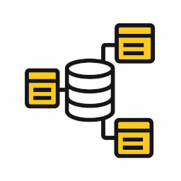
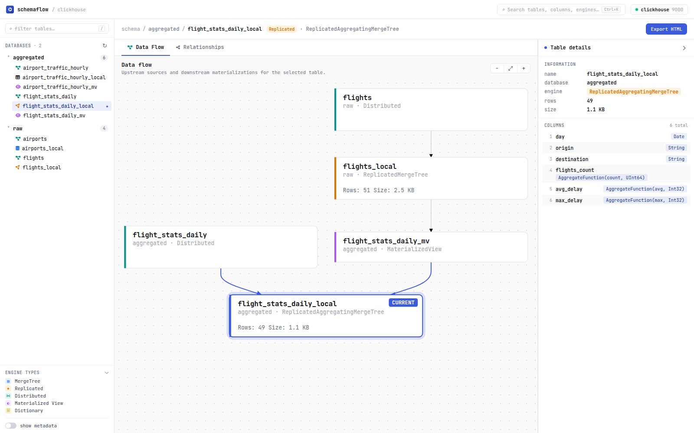
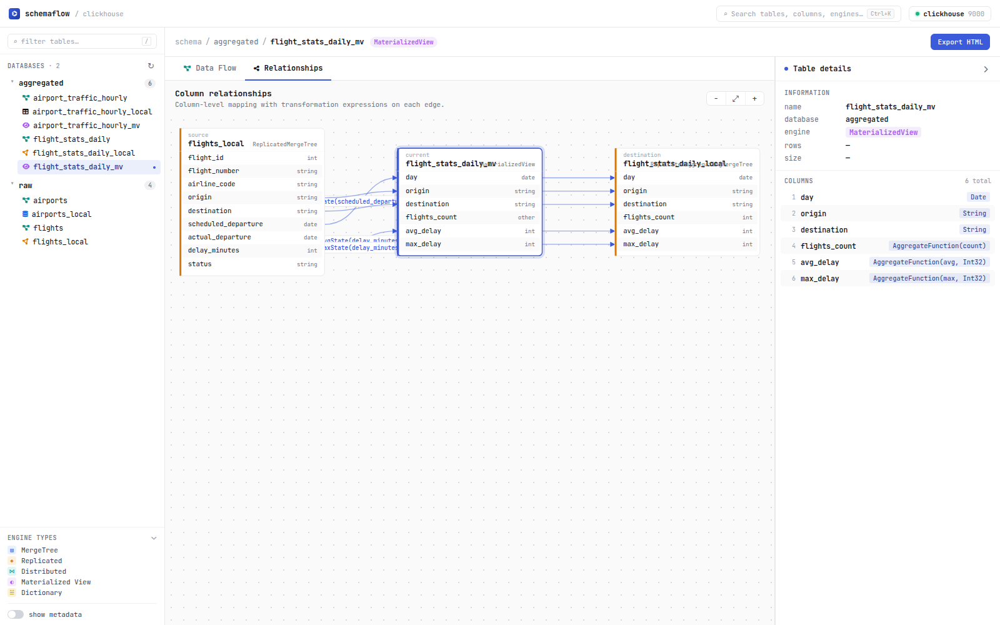
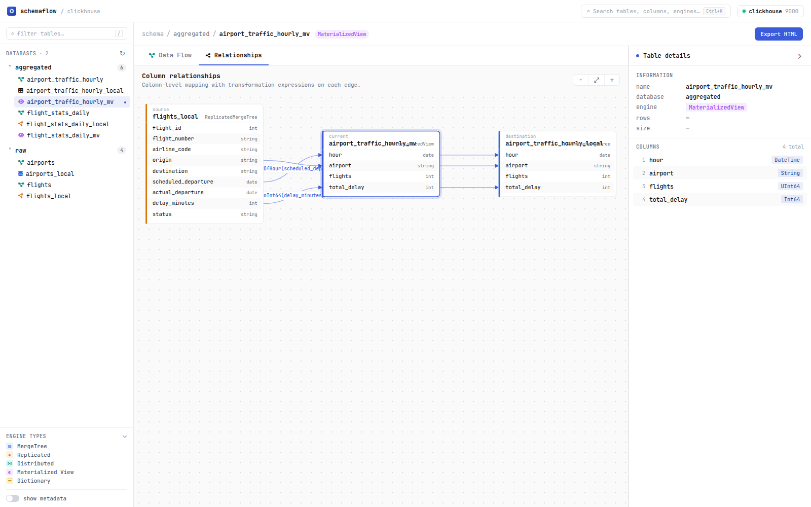

<div align="center">

# ClickHouse Schema Flow Visualizer



An open-source web application for visualizing ClickHouse table relationships. It connects to a ClickHouse instance, parses `system.tables` metadata (engine types, dependencies, materialized view SELECTs), and renders interactive table-level **data flow** diagrams alongside column-level **relationships** with the transformation expressions on each edge. Diagrams are laid out with [Dagre](https://github.com/dagrejs/dagre) and rendered as plain SVG — no client-side diagramming runtime required.

[](https://github.com/FulgerX2007/clickhouse-schemaflow-visualizer/actions)
[](https://opensource.org/licenses/MIT)
[](https://github.com/FulgerX2007/clickhouse-schemaflow-visualizer/releases)
[](https://goreportcard.com/report/github.com/fulgerX2007/clickhouse-schemaflow-visualizer)

</div>

## 📸 Screenshots

<div align="center">







</div>

## ✨ Features

- 🔍 Browse ClickHouse databases and tables with an intuitive sidebar
- 🧭 **Data Flow** view — table-level upstream sources and downstream materializations for the selected table
- 🪢 **Relationships** view — column-level mapping with the parsed transformation expression on each edge (e.g. `toStartOfHour(scheduled_departure)`, `avgState(delay_minutes)`)
- 🎨 Engine-type icons and colour coding for MergeTree, Replicated, Distributed, MaterializedView, and Dictionary engines
- 🔦 Click a column in the Relationships view to highlight its full data path through the pipeline
- ⌨️ Live sidebar filter and a `Ctrl+K` / `⌘K` command palette to jump to any table, column, or engine
- 📈 Optional metadata overlay showing row counts and on-disk size per table
- 💾 Export the current diagram as a standalone HTML file (self-contained, no external assets)
- 🔒 TLS connection to ClickHouse with optional skip-verify and custom CA / client certificates
- 📱 Responsive layout that works on desktop and tablet viewports

## 🏗️ Architecture

- **Backend**: Go (Gin) — single binary that serves both the REST API under `/api/` and the embedded static frontend
- **Frontend**: vanilla HTML / CSS / JavaScript; diagrams laid out with [Dagre](https://github.com/dagrejs/dagre) and rendered as inline SVG by a custom renderer (no Mermaid runtime)
- **Database**: ClickHouse — the visualizer is read-only and only queries `system.tables`, `system.columns`, and the `CREATE` statements they expose

## 📋 Prerequisites

- Docker and Docker Compose
- ClickHouse server
- Go 1.26+ (only required if building from source — Docker users can skip)

## 🚀 Installation and Setup

### Using GitHub Container Registry

1. Pull the container from GitHub Container Registry:
   ```bash
   docker pull ghcr.io/fulgerx2007/clickhouse-schemaflow-visualizer:latest
   ```

2. Create a `.env` file with your ClickHouse connection details (see configuration example below)

3. Run the container:
   ```bash
   docker run -p 8080:8080 --env-file .env ghcr.io/fulgerx2007/clickhouse-schemaflow-visualizer:latest
   ```

4. Access the web interface at http://localhost:8080

### Using Docker Compose (Recommended)

1. Clone the repository:
   ```bash
   git clone https://github.com/fulgerX2007/clickhouse-schemaflow-visualizer.git
   cd clickhouse-schemaflow-visualizer
   ```

2. Start the application:
   ```bash
   docker-compose up -d
   ```

3. Access the web interface at http://localhost:8080

### Manual Setup

Requires Go 1.26 or newer (see `go.mod`).

1. Clone the repository:
   ```bash
   git clone https://github.com/fulgerX2007/clickhouse-schemaflow-visualizer.git
   cd clickhouse-schemaflow-visualizer
   ```

2. Configure the `.env` file with your ClickHouse connection details:
   ```
   # ClickHouse Connection Settings
   CLICKHOUSE_HOST=localhost
   CLICKHOUSE_PORT=9000
   CLICKHOUSE_USER=default
   CLICKHOUSE_PASSWORD=
   CLICKHOUSE_DATABASE=default

   # ClickHouse TLS Settings
   CLICKHOUSE_SECURE=false
   CLICKHOUSE_SKIP_VERIFY=false
   # CLICKHOUSE_CERT_PATH=/path/to/cert.pem
   # CLICKHOUSE_KEY_PATH=/path/to/key.pem
   # CLICKHOUSE_CA_PATH=/path/to/ca.pem
   # CLICKHOUSE_SERVER_NAME=clickhouse.example.com

   # Web Interface Settings
   SERVER_ADDR=:8080
   GIN_MODE=debug
   ```

3. Install Go dependencies:
   ```bash
   go mod download
   ```

4. Run the application:
   ```bash
   go run main.go
   ```

5. Access the web interface at http://localhost:8080

## 📖 Usage

### 1. Browse databases and tables
- The left panel lists every database and the tables it contains.
- Click a database to expand or collapse its table list.
- Click a table to load it into the main panel.
- Use the **filter tables** input (or press `/`) to narrow the sidebar by name.
- Press `Ctrl+K` (or `⌘K` on macOS) to open the command palette and jump to any table, column, or engine type.

### 2. Switch between Data Flow and Relationships
- **Data Flow** shows the selected table at the centre, with upstream sources flowing in and downstream materializations flowing out — the easiest way to see how data reaches a given table.
- **Relationships** shows the same set of tables broken out column-by-column, with the parsed SELECT expression of any Materialized View labelled on the connecting edge. Click a column to highlight its full upstream and downstream path.

### 3. Toggle table metadata
- Use the **show metadata** toggle below the engine-types legend to display row counts and on-disk size under each table name in the sidebar.
- Metadata is hidden by default for a cleaner sidebar; your preference is persisted in `localStorage`.

### 4. Export diagrams
- Click **Export HTML** to save the current diagram as a self-contained HTML file you can drop into a wiki, attach to a ticket, or commit to a runbook.

## 🔧 How It Works

The application is read-only: it queries ClickHouse system tables and never writes anything back. On first request to `/api/databases` it discovers everything once and caches it in memory; click the sidebar **↻** button to refresh.

Relationship discovery is engine-aware:
- `MergeTree` / `Replicated*MergeTree` — leaf tables; show as the source or sink of a flow.
- `Distributed` — the `Distributed(...)` engine arguments are parsed to find the underlying local cluster table; the visualizer draws an edge from the local table to its Distributed wrapper.
- `MaterializedView` — the MV's stored `SELECT` is parsed to find both the source table (`FROM ...`) and the per-column transformation expressions; an edge is drawn from each referenced source column to the corresponding target column, with the expression rendered as the edge label.
- `Dictionary` — the dictionary's `SOURCE(...)` clause is inspected to link the dictionary back to its underlying table.

Node IDs in the diagrams use CityHash32 of the fully qualified table name to stay deterministic and collision-resistant across reloads, and column names / expressions are sanitized so anything containing reserved characters still renders.

## 🧪 Local test stack

The repository ships with a separate compose file that boots a single-node ClickHouse cluster (with ZooKeeper, so `Replicated*` and `Distributed` engines work) and seeds it with a small `airports` / `flights` demo schema designed to exercise every relationship-parsing branch above:

```bash
docker compose -f docker-compose.clickhouse-test.yml up -d
```

This brings up:
- ZooKeeper on `:2181`
- ClickHouse on `:9000` (native) and `:8123` (HTTP), credentials `default` / `default`
- The visualizer on `:8080`, pre-wired to the ClickHouse container

The seed (`scripts/clickhouse_test_engines.sql`) creates two databases:
- **`raw`** — `airports_local` (`MergeTree`) and `flights_local` (`ReplicatedMergeTree`), each with a `Distributed` wrapper.
- **`aggregated`** — `flight_stats_daily_local` (`ReplicatedAggregatingMergeTree`) and `airport_traffic_hourly_local` (`SummingMergeTree`), each fed by a Materialized View from `raw.flights_local` and exposed through a `Distributed` wrapper.

Tear down and re-seed at any time with `docker compose -f docker-compose.clickhouse-test.yml down -v`.


## 👨‍💻 Development

### Project Structure

```
clickhouse-schemaflow-visualizer/
├── api/                              # HTTP handlers (Gin)
│   └── handlers.go                   # /api/connection, /api/databases, /api/columns, /api/dataflow, /api/relationships, /api/table
├── assets/                           # Project assets
│   └── screenshots/                  # Screenshots used in this README
├── config/                           # Configuration handling
│   └── config.go                     # Environment configuration loader
├── models/                           # Domain logic
│   └── clickhouse.go                 # ClickHouse client, engine-aware relationship discovery, diagram model
├── scripts/                          # Helper SQL and packaging scripts
│   └── clickhouse_test_engines.sql   # Seed schema for the local test stack
├── static/                           # Embedded frontend
│   ├── css/styles.css                # Stylesheet
│   ├── html/index.html               # Single-page shell
│   ├── img/                          # Logo and icons
│   └── js/                           # Frontend JavaScript
│       ├── app.js                    # Sidebar, command palette, API wiring
│       ├── diagram.js                # Dagre layout + SVG renderer for both views
│       └── vendor/                   # Bundled third-party JS (Dagre)
├── .env.example                      # Example environment configuration
├── docker-compose.yml                # Production-style compose (visualizer only)
├── docker-compose.clickhouse-test.yml # Local test stack: ZooKeeper + ClickHouse + visualizer
├── Dockerfile                        # Multi-stage build for the visualizer image
├── go.mod / go.sum                   # Go module dependencies
├── main.go                           # Entry point: loads .env, registers routes, serves static files
└── README.md                         # This file
```

### Building from Source

1. Build the Docker image:
   ```bash
   docker build -t clickhouse-schemaflow-visualizer .
   ```

2. Run the container:
   ```bash
   docker run -p 8080:8080 --env-file .env clickhouse-schemaflow-visualizer
   ```

## 📄 License

This project is licensed under the MIT License - see the LICENSE file for details.

## 🤝 Contributing

Contributions are welcome! Please feel free to submit a Pull Request.
