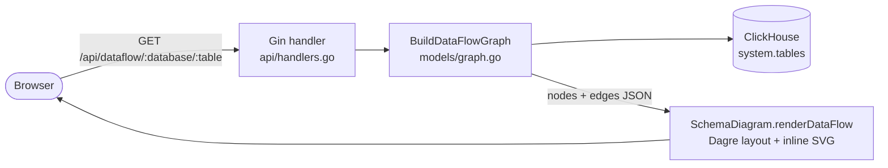

# Diagrams

Source-controlled diagrams for this project. Prefer **text-based** diagrams so they
diff and review like code and never drift into a binary nobody can edit.

> **Mermaid here is not the app's renderer.** The diagrams *this repository documents
> itself with* are Mermaid. The diagrams *the application draws at runtime* are not:
> `static/js/diagram.js` is a hand-written renderer that lays nodes out with the bundled
> Dagre build and emits SVG through `document.createElementNS` (see its header comment
> and `renderDataFlow` / `renderRelationships` at `static/js/diagram.js:240` and `:412`).
> The only third-party diagram asset the page loads is
> `static/js/vendor/dagre.min.js` (`static/html/index.html:31`); no Mermaid runtime is
> shipped or fetched, as `README.md:44` states outright, and the Export HTML path in
> `static/js/app.js:474` inlines the SVG precisely so the export has "no CDN, no Mermaid,
> no Dagre". Do not read a `.md` file in this directory as a description of how the
> frontend renders.
>
> Stale string, not a contradiction: `.goreleaser.yaml:48` and `.goreleaser.yaml:75` still
> describe the packaged app as using "Mermaid.js diagrams". That text predates the current
> renderer and is wrong; the code is the authority.

## Convention

- **Format:** Mermaid (` ```mermaid ` blocks in `.md`) or PlantUML (`.puml`).
  Mermaid is the convention here — GitHub renders ` ```mermaid ` fences in Markdown with
  no toolchain, and this repository has no diagram build step. There is currently no
  PlantUML renderer, no image pipeline and no diagram lint in the repo; both GitHub
  Actions workflows (`.github/workflows/release.yml`, `.github/workflows/docker-publish.yml`)
  trigger only on `v*` tags, so nothing validates a diagram automatically at any point.
- **Naming:** `kebab-case.md` / `kebab-case.puml` describing the view
  (e.g. `component-overview.md`, `request-data-flow.md`). One view per file, named for
  what it shows rather than for the component it belongs to.
- **Keep them current:** a diagram that contradicts the code is worse than none.
  Update the diagram in the same change that changes the structure it shows.
- Reference diagrams from `ARCHITECTURE.md` rather than duplicating them.
- These files are repository-only: the release archive `files:` list in `.goreleaser.yaml`
  ships `README.md`, `LICENSE*`, `static/**/*` and `.env.example`, so nothing under
  `docs/` reaches a built package.

## Current state

This directory holds no diagram sources yet — only this README. A search across the
repository (excluding `node_modules/`) for `*.mmd`, `*.puml`, `*.plantuml` and `*.drawio`
returns nothing, and among tracked files `grep -i` for `mermaid` matches only `README.md:44`
and `static/js/app.js:474` (both of which say Mermaid is *not* used at runtime) plus the two
stale `.goreleaser.yaml` lines noted above. (`.claude/settings.local.json` also matches, but
it is local tool configuration, not project content.)

The first diagram for this project belongs inline in the repository-root `ARCHITECTURE.md`
as a ` ```mermaid ` flow of the request/data path. Move a diagram out of `ARCHITECTURE.md`
into its own file here only when it grows past what reads well inline, and link to it from
`ARCHITECTURE.md` when you do.

TODO: decide whether the flow diagram now in `ARCHITECTURE.md` stays inline or moves into
`component-overview.md` here.

## Recommended diagrams

| Diagram | Shows |
|---------|-------|
| `component-overview` | Major components and their relationships |
| `request-data-flow` | End-to-end path of a representative request/record |
| `deployment-topology` | Where things run and how they connect |

Candidates specific to this codebase, none of which exist yet:

| Candidate file | Would show | Source of truth |
|---|---|---|
| `request-data-flow.md` | Browser → `GET /` (rendered through `html/template` with a per-process `BuildID` cache-buster) → `GET /api/*` → graph builders → ClickHouse `system.tables` / `system.columns` → SVG in the browser | `main.go:57-79`, `api/handlers.go:26-34`, `models/graph.go` (`BuildDataFlowGraph:145`, `BuildRelationshipsGraph:245`, `BuildColumnIndex:114`), `static/js/diagram.js` |
| `engine-parsing.md` | The per-engine decision tree used to extract relations from `create_table_query` / `engine_full` by positional string splitting (MergeTree and `Replicated*`, `Dictionary*` via the `loading_dependencies_*` columns, `Distributed`, `MaterializedView` source→mv→destination), and how the raw engine collapses into the five `EngineType` values `mergetree` / `replicated` / `distributed` / `mview` / `dictionary` | `models/clickhouse.go` `getTablesRelations:200`, `models/graph.go` `ClassifyEngine:22` (constants at `models/graph.go:13-17`) |
| `cache-lifecycle.md` | Which reads are served from the package-level caches `DatabasesData` / `TableRelations` / `TableMetadata` — filled on first use and never invalidated, so a process restart is the only way to pick up a schema change — versus the uncached per-request paths `GetTableColumns`, `BuildColumnIndex` and `isDistributedTable` | `models/clickhouse.go:34-36`, `models/clickhouse.go` `GetTableColumns:429` and `isDistributedTable:642`, `models/graph.go` `BuildColumnIndex:114` |
| `deployment-topology.md` | The two supported topologies: the production compose file (single container, `network_mode: "host"`, `env_file: .env`, `8080:8080`) and the local test stack (ZooKeeper + ClickHouse seeded from `scripts/clickhouse_test_engines.sql` + the visualizer, on a `clickhouse-network` bridge) | `docker-compose.yml`, `docker-compose.clickhouse-test.yml`, `Dockerfile` |

TODO: draw `request-data-flow.md`.

TODO: draw `engine-parsing.md`.

TODO: draw `cache-lifecycle.md`.

TODO: draw `deployment-topology.md`.

TODO: decide whether the three template rows above (`component-overview`,
`request-data-flow`, `deployment-topology`) are the set this project commits to, or whether
`engine-parsing` and `cache-lifecycle` replace `component-overview`.

## Example (Mermaid)

Syntax example, deliberately coarse — it is not one of the diagrams listed above and is not
a substitute for them. Every box below is checkable: the six `/api/` routes are registered
in `api/handlers.go:26-34`, the graph builders live in `models/graph.go`, and the app queries
only `system.tables` and `system.columns` (`models/clickhouse.go`, `models/graph.go`).


